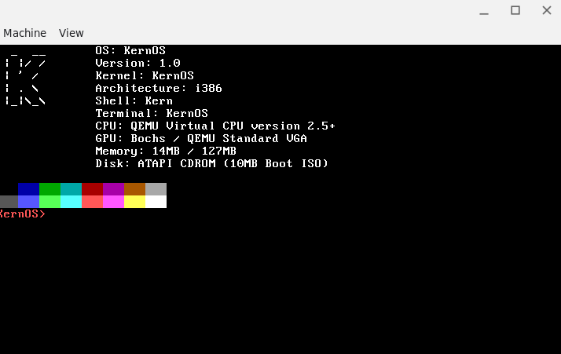
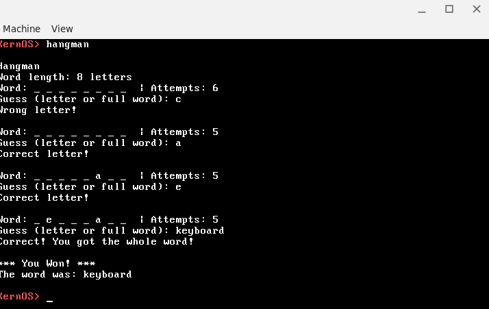
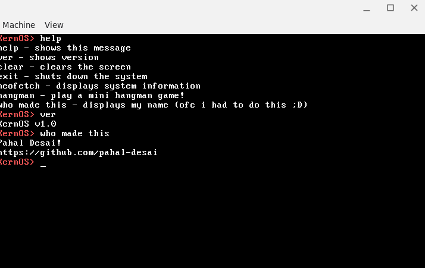

# KernOS
This is an operating system kernel written in C. I'm new to this and learning.

## Features
* It has runs basic commands like neofetch, ver, clear, help, and an easter egg command.
* It has a mini game too (hangman).

## why i made this??!!
just for fun -_-
I wanted to learn assembly and more on how operating systems work. That's why i started this project.
And i was heavily inspired by the story of temple os.

## What features i want to add in future??
* have some basic terminal keyboard shortcuts (like ctrl+c to inturrupt, up arrow key to get previous commands, etc)
* create/delete/edit files
* run a video game (doom to be precise :D)

## Screenshots:-
* neofetch

* hangman

* other commands

* shutdown
